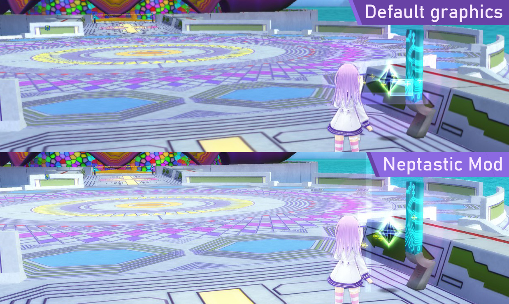

# Neptastic Mod

Graphical improvements mod for Hyperdimension Neptunia Re;Birth2 & Re;Birth3 games.

## Features:
 - Resolution upscaling and downscaling
 - Fitting resolution to window size (Base game always renders at 1088p)
 - Disabled FXAA that degraded visuals inside dungeons
 - Tutorials don't break in Re;Birth3
 - Anisotropic texture filtering
 - FPS unlock for Re;Birth2
 - Improved Bloom shader
 - Bloom intensity & contrast settings
 - Increased shadow quality - to 8192x8192 and beyond
 - Outlines intensity control, as well as optional simple outlines shader
 - VSync options: On, Off, Adaptive
 - Nep: Nep

## In short:

## Install:
 1. Download the latest .zip file from [Releases](https://github.com/tlaik/neptastic/releases/)
 2. Extract both files inside, opengl32.dll and nep.ini into the game's base folder.
     - You can find the game folder by right-clicking on your Nep game in Steam library, choosing "Properties", going to "Local files" tab and clicking "Browse".
 3. **If installing for Re;Birth3:** Created a folder named "Birth3" inside the base game folder and move the mod files into it.

## Configure:
 Default configuration already provides all the improvements, including 2.0x resolution and 4K shadows.\
 If you wish to tune it yourself - Open the nep.ini file with any text editor. If needed, right-click on it and go to "Open With"\
 All the options have self-explanatory names, mirroring the list of features, and have comments explaining their effect and suggested values.
 
 If you ever mess up your configuration, you can just delete the nep.ini file, and a new one with default settings will be created next time you start the game.

 Also, you can copy these config files between both games.

## Screenshots & Examples:

## Credits:
 - [GLProxy](https://github.com/glampert/GLProxy) - Used as a base to barge into the game process and intercept OpenGL calls.
 - [subhook](https://github.com/Zeex/subhook) - Hooking certain CG and CRT calls at runtme.
 - [Hyperresolution Neptunia](https://github.com/PeterTh/neptunia_hyperres) - Code to control main game resolution.
 - [Single-pass Gaussian Blur by mrharicot](https://www.shadertoy.com/view/XdfGDH) - Used in the new Bloom shader.